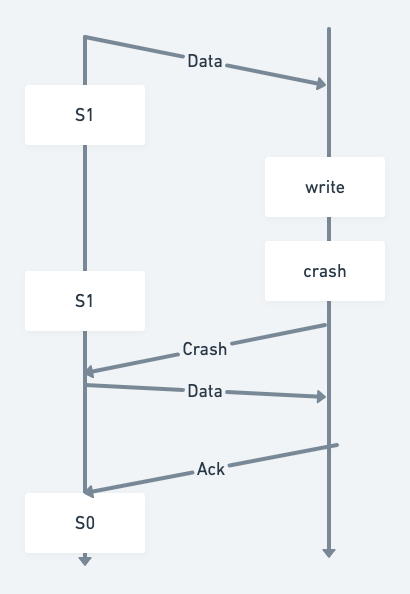
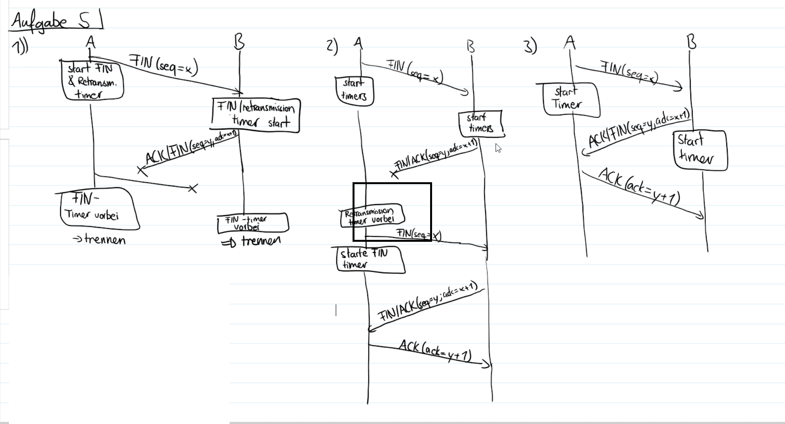
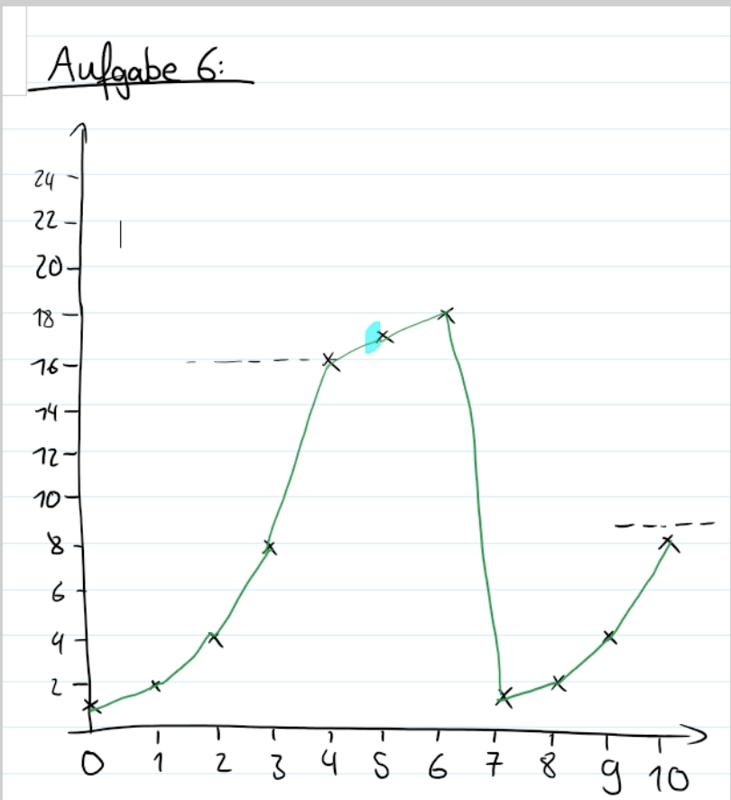

# Aufgaben

## Aufgabe 1
korrekte Antwort(en) ist: 
- 2
- evtl 3
- 5
- 6

## Aufgabe 2

## Aufgabe 3
**Effizienz**:
- Gesamtauslastung der Netzwerkes

**Fairness**: 
- jeder Teilnehmer soll einen fairen Anteil an der Kapazität haben

**Konvergenz**:
Algorithmus soll schnell konvergieren

## Aufgabe 4
**Flusskontrolle**:
- neue Verbindungen werden abgelehnt, solange Überlast besteht 

**Überlastkontrolle**:
- ein Gerät darf nur eine limitierte Anzahl von Paketen übertragen bis es ein Acknoledgement erhält
- Pakete darüber hinaus werden verworfen

## Aufgabe 5

## Aufgabe 6

